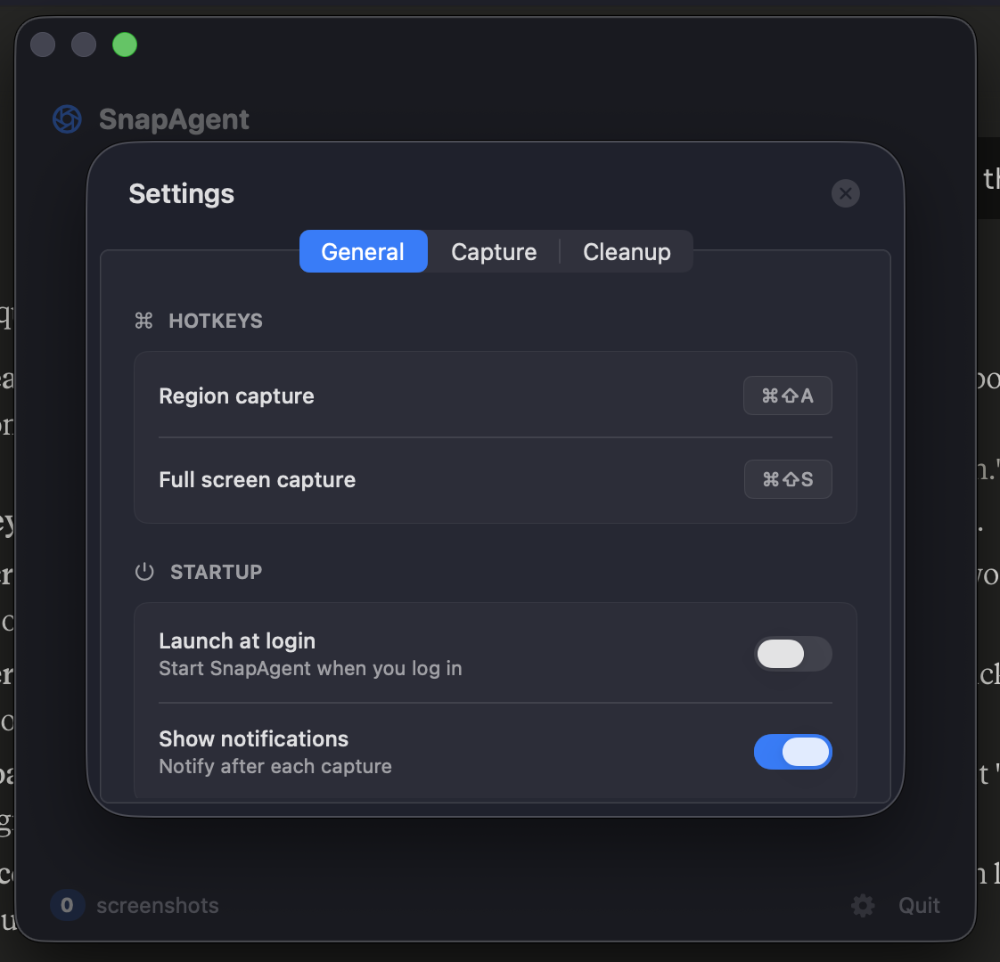

# SnapAgent

[](LICENSE)

A lightweight macOS menu bar app that captures screenshots and injects file paths directly into your terminal. Built for developers who work with AI coding tools.

**Website:** [snapagent.baxlylabs.com](https://snapagent.baxlylabs.com)


## Download

[Download the latest release](https://github.com/joshuacolvin/SnapAgent/releases/latest/download/SnapAgent.dmg) — open the DMG and drag SnapAgent to Applications.

## What it does

1. Hit a hotkey to capture a screenshot (region or full screen)
2. SnapAgent saves it to `~/.ai-screenshots/` — not your Desktop
3. The file path is automatically pasted into your last active terminal
4. Old screenshots are auto-cleaned so they don't pile up

## Keyboard shortcuts

| Action | Default shortcut |
|---|---|
| Region capture | ⌘⇧A |
| Full screen capture | ⌘⇧S |

Shortcuts are customizable in Settings.

## Compatibility note

SnapAgent works with **terminal-based AI workflows** — tools like Claude Code, Codex CLI, and Copilot in the terminal. It is not compatible with desktop chat apps like Claude Desktop, ChatGPT, or other GUI-based AI clients.

## Features

- **Auto-paste to terminal** — copies the file path and pastes it into your last active terminal in one step
- **Auto-cleanup** — deletes old screenshots after a configurable interval (default: 24 hours)
- **Customizable hotkeys** — change capture shortcuts to whatever you prefer
- **Multiple image formats** — save as PNG or JPEG
- **Works with major terminals** — Terminal, iTerm2, Warp, Ghostty, VS Code, Cursor, Hyper



## Permissions

SnapAgent requests Screen Recording and Accessibility access on first launch. Screen Recording is needed to capture screenshots. Accessibility is needed to paste file paths into your terminal.

## Requirements

- macOS 13+
- Apple Silicon or Intel

## Development

Built with Swift/SwiftUI using Swift Package Manager.

```bash
open SnapAgent.xcodeproj
```

## Scripts

| Script | Description |
|---|---|
| `scripts/release.sh` | Full release: bump version, build, sign, notarize, DMG, GitHub release, deploy site |
| `scripts/cleanup.sh` | Remove app, settings, and data for a clean reinstall |
| `scripts/deploy-site.sh` | Deploy the landing page to Cloudflare Pages |
| `scripts/build-app.sh` | Build the app locally |
| `scripts/create-dmg-bg.py` | Generate the DMG background image |

## Releasing a new version

```bash
./scripts/release.sh 1.2.0
```

This single command handles everything:
1. Bumps `MARKETING_VERSION` in the Xcode project
2. Updates the version on the landing page
3. Builds, signs, and notarizes the app
4. Creates the styled DMG with drag-to-install
5. Commits the version bump, tags, and pushes
6. Creates a GitHub release with the DMG attached
7. Deploys the site to Cloudflare Pages

The download links on the site point to `/releases/latest/download/SnapAgent.dmg`, so they automatically serve the newest release.

### Prerequisites

- Developer ID certificate (`security find-identity -v -p codesigning`)
- Notarization credentials (`xcrun notarytool store-credentials "SnapAgent"`)
- [gh](https://cli.github.com/) CLI (authenticated)
- [wrangler](https://developers.cloudflare.com/workers/wrangler/) CLI (authenticated)
- [create-dmg](https://github.com/create-dmg/create-dmg) (`brew install create-dmg`)
